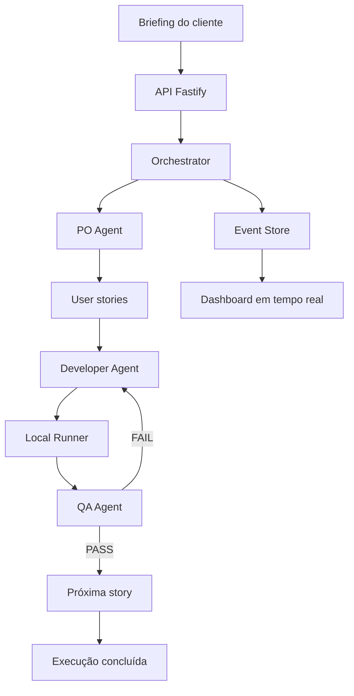
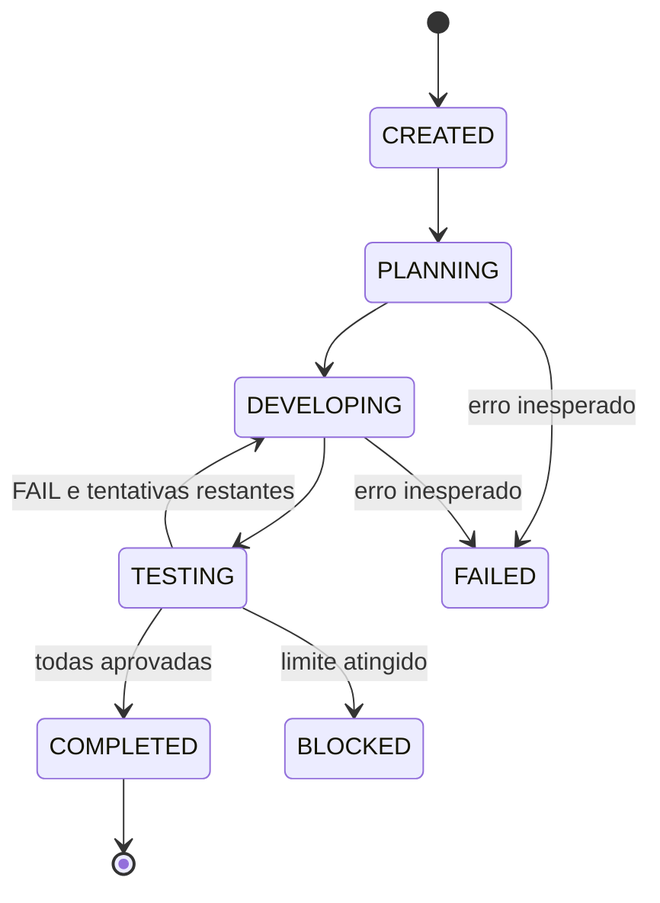

# Autonomous Software Squad

Sistema multiagente que transforma um briefing de cliente em backlog, implementação, validação e aplicação web, mantendo a comunicação entre os agentes visível e auditável.

O projeto foi concebido para a **Trilha B — Squad Autônomo de Agentes** do Hackathon Reply. O objetivo não é apresentar apenas três chats independentes, mas um fluxo coordenado no qual Product Owner, Developer e Quality Assurance possuem responsabilidades específicas e são controlados por uma máquina de estados.

## Estado atual

| Componente | Estado | Implementação atual |
|---|---|---|
| Dashboard | Funcional | React, TypeScript e SSE |
| API | Funcional | Fastify |
| Orquestrador | Funcional | Máquina de estados determinística |
| Product Owner | Integrado com IA | Codex CLI autenticado pelo ChatGPT |
| Developer | Simulado | Retorna implementação e correção previsíveis |
| QA | Simulado | Reprova a primeira tentativa e aprova a correção |
| Build e testes | Reais | Executados pelo Local Runner |
| Auditoria | Funcional | `state.json` e `events.jsonl` |
| Workspace isolado | Funcional | Uma cópia do template por execução |
| Docker Runner | Planejado | Diferencial posterior ao MVP |

> O PO já gera stories de acordo com o briefing usando o Codex. O Developer e o QA reais ainda fazem parte do roadmap. Os mocks permanecem intencionalmente disponíveis como fallback de demonstração.

## Fluxo principal



## Agentes

### Product Owner

- interpreta o briefing;
- cria de uma a seis user stories;
- ordena as stories por prioridade;
- define critérios de aceitação objetivos;
- devolve JSON validado por schema;
- não altera arquivos do projeto.

### Developer

- recebe uma story e seus critérios;
- recebe o último relatório do QA quando há reprovação;
- implementa ou corrige a funcionalidade no workspace da execução;
- informa arquivos alterados e comandos necessários.

Atualmente esse agente está simulado. A versão real com Codex é o próximo marco.

### Quality Assurance

- recebe a story e o resultado do Developer;
- analisa evidências reais de build e testes;
- verifica os critérios de aceitação;
- retorna `PASS` ou `FAIL`;
- informa as correções necessárias.

Atualmente a decisão semântica é simulada, mas build e testes são executados de verdade.

## Máquina de estados



O orquestrador, e não outro modelo de linguagem, decide as transições mecânicas. Isso torna o fluxo previsível, testável e auditável.

## Arquitetura do repositório

```text
autonomous-software-squad/
├── apps/
│   ├── api/                 # API Fastify e composição das dependências
│   └── dashboard/           # Interface React e timeline SSE
├── packages/
│   ├── agents/              # Contratos e agentes mock/Codex
│   ├── codex-client/        # Adapter para codex exec
│   ├── event-store/         # Estado JSON e eventos JSONL
│   ├── orchestrator/        # Máquina de estados
│   ├── runner/              # LocalRunner e WorkspaceManager
│   └── schemas/             # Contratos compartilhados com Zod
├── templates/
│   └── react-task-app/      # Base copiada em cada execução
├── generated-projects/      # Workspaces descartáveis gerados
├── data/runs/               # Estados e eventos auditáveis
├── prompts/                 # Prompts especializados
├── docs/                    # Arquitetura e roteiro da demonstração
├── AGENTS.md                # Regras para agentes que editam o repositório
├── .env.example
└── package.json
```

## Tecnologias

- Node.js e TypeScript;
- npm Workspaces;
- React e Vite;
- Fastify;
- Server-Sent Events;
- Zod e JSON Schema;
- Vitest;
- Codex CLI;
- JSONL para auditoria;
- WSL2 no ambiente de desenvolvimento.

## Pré-requisitos

- Windows 11 com WSL2 e Ubuntu, ou uma distribuição Linux;
- Node.js instalado no Linux;
- npm;
- Git;
- Codex CLI nativo do Linux/WSL;
- autenticação válida do Codex, caso `LLM_PROVIDER=codex`.

O repositório deve ficar no filesystem Linux, por exemplo:

```text
/home/<usuario>/projects/autonomous-software-squad
```

Evite executar o projeto diretamente em `/mnt/c`, pois operações intensivas de arquivos podem ficar mais lentas.

## Instalação

```bash
git clone <URL_DO_REPOSITORIO>
cd autonomous-software-squad
nvm use
npm install
cp .env.example .env
```

Para usar o Codex com o plano do ChatGPT:

```bash
codex login
codex login status
```

O arquivo `.env` deve conter:

```env
LLM_PROVIDER=codex
LLM_MODEL=
LLM_API_KEY=
EXECUTION_MODE=local
MAX_QA_ATTEMPTS=3
GENERATED_PROJECTS_PATH=./generated-projects
PORT=3000
```

Não versione `.env`, credenciais ou arquivos internos de autenticação do Codex.

## Execução

Em um terminal, inicie a API:

```bash
npm run dev -w @squad/api
```

Em outro terminal, inicie o dashboard:

```bash
npm run dev -w @squad/dashboard
```

Acesse:

```text
http://localhost:5173
```

Verifique a API:

```bash
curl -s http://localhost:3000/health
```

## Exemplo de briefing

```text
Crie uma aplicação web para controle de equipamentos industriais. O usuário
deve cadastrar equipamentos com nome, código patrimonial e estado operacional,
listar os registros e filtrar por estado. O código patrimonial deve ser único.
```

## Endpoints

| Método | Endpoint | Responsabilidade |
|---|---|---|
| `GET` | `/health` | Saúde da API e provedor configurado |
| `POST` | `/runs` | Criar e iniciar uma execução |
| `GET` | `/runs/:runId` | Consultar o estado atual |
| `GET` | `/runs/:runId/events` | Consultar o histórico completo |
| `GET` | `/runs/:runId/stream` | Acompanhar eventos por SSE |
| `GET` | `/runs/:runId/artifact` | Consultar o workspace resultante |

## Auditabilidade

Cada execução possui uma pasta própria:

```text
data/runs/<run-id>/
├── state.json
└── events.jsonl
```

Um evento registra, entre outros campos:

```json
{
  "eventId": "evt-...",
  "runId": "run-...",
  "timestamp": "2026-08-15T00:00:00.000Z",
  "actor": "QA",
  "action": "STORY_REJECTED",
  "message": "US-001 foi rejeitada e retornará ao Developer.",
  "storyId": "US-001",
  "metadata": {
    "attempt": 1
  }
}
```

São registrados eventos de planejamento, implementação, instalação, build, testes, aprovação, reprovação, tentativas e encerramento.

## Execução controlada

O `LocalRunner`:

- trabalha somente dentro de `generated-projects`;
- não usa texto livre diretamente como comando de shell;
- aceita uma lista restrita de comandos npm;
- captura `stdout`, `stderr`, exit code e duração;
- aplica timeout;
- envia as evidências ao QA.

Comandos permitidos no MVP:

```text
npm install
npm run build
npm test
npm run typecheck
```

O Docker não é requisito do produto atual. Um `DockerRunner` poderá ser criado posteriormente atrás da mesma abstração, sem reconstruir o orquestrador.

## Qualidade

Antes de concluir uma alteração, execute:

```bash
npm run typecheck
npm run build
npm test
```

Os testes cobrem atualmente:

- validação dos schemas;
- persistência e ordem dos eventos;
- proteção contra `runId` inseguro;
- comportamento dos agentes simulados;
- retorno `QA FAIL -> Developer`;
- conclusão e limite de tentativas;
- allowlist do Runner;
- proteção do diretório de execução;
- preparação dos workspaces.

## Limitações conhecidas

- Developer e QA ainda não utilizam Codex para julgamento real;
- o Developer simulado ainda não modifica o produto conforme cada briefing;
- o template inicial é uma aplicação React de tarefas;
- a execução é sequencial;
- o Local Runner oferece controle, mas não isolamento forte como um container;
- pacotes internos precisam ser recompilados quando seus arquivos `src` mudam;
- JSONL é adequado ao MVP, mas não substitui um banco transacional em escala;
- interrupção e retomada automática de uma execução ainda não foram implementadas.

## Roadmap

1. implementar `CodexDeveloperAgent` com escrita limitada ao workspace;
2. implementar `CodexQualityAssuranceAgent` com evidências por critério;
3. externalizar e versionar todos os prompts;
4. transmitir logs do Codex para a timeline;
5. permitir abrir ou baixar a aplicação gerada;
6. melhorar o modo watch dos pacotes internos;
7. adicionar retomada de execuções interrompidas;
8. criar `DockerRunner` opcional;
9. adicionar autenticação e persistência em banco, caso o produto evolua.

## Demonstração sugerida

1. abrir o dashboard;
2. inserir um briefing industrial;
3. mostrar o PO criando stories específicas;
4. acompanhar as transições na timeline;
5. mostrar build e testes reais;
6. mostrar uma reprovação do QA;
7. mostrar a correção automática e aprovação;
8. abrir `events.jsonl` e demonstrar a auditoria;
9. apresentar o workspace criado para a execução;
10. explicar as limitações atuais e o próximo marco.

## Decisões principais

- TypeScript em todas as camadas reduz troca de contexto;
- máquina de estados controla o workflow de maneira determinística;
- schemas evitam comunicação interna ambígua;
- mocks permitem demonstrações sem depender de rede ou modelo;
- Codex CLI permite usar autenticação do ChatGPT no ambiente local;
- um template controlado reduz tempo, custo e variabilidade;
- JSONL simplifica auditoria no MVP;
- Docker permanece opcional até o fluxo principal estar estável.

## Licença

Defina a licença antes da publicação pública do repositório. Para um projeto aberto, MIT é uma opção simples; valide essa decisão com todos os integrantes da equipe.
